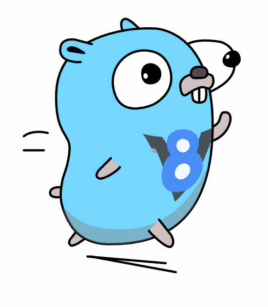

# Execute JavaScript from Go

[](https://pkg.go.dev/github.com/ChessCom/v8go)
[](https://github.com/ChessCom/v8go/actions/workflows/ci.yml)



## Install

```bash
go get github.com/ChessCom/v8go
```

**Supported platforms:** linux/amd64, linux/arm64, darwin/amd64, darwin/arm64, android/amd64, android/arm64.

Prebuilt V8 static libraries are included for all platforms so you should
not need to build V8 yourself.

## Usage

```go
import v8 "github.com/ChessCom/v8go"
```

### Running a script

```go
ctx := v8.NewContext()
ctx.RunScript("const add = (a, b) => a + b", "math.js")
ctx.RunScript("const result = add(3, 4)", "main.js")
val, _ := ctx.RunScript("result", "value.js")
fmt.Printf("addition result: %s", val)
```

### One VM, many contexts

```go
iso := v8.NewIsolate()
ctx1 := v8.NewContext(iso)
ctx1.RunScript("const multiply = (a, b) => a * b", "math.js")

ctx2 := v8.NewContext(iso)
if _, err := ctx2.RunScript("multiply(3, 4)", "main.js"); err != nil {
  // this will error as multiply is not defined in this context
}
```

### Snapshots for cold start

V8 startup blobs let you do all the expensive parse + compile + warmup
work once at build time and recover the resulting heap for free at
runtime. This fork exposes both a low-level `SnapshotCreator` binding
and a high-level Pack/Restore API.

**Script bundles (IIFE / global assignment):**

```go
packed, err := v8.PackBundle(v8.PackOptions{
    Source:            string(bundleJS),
    Origin:            "bundle.js",
    DeterministicTime: true,
    SeedMillis:        v8.SeedTimeMillis,
    FCH:               v8.FunctionCodeKeep,
})
blob, err := packed.Marshal()

p, err := v8.UnmarshalPackedSnapshot(blob)
iso, err := p.RestoreIsolate(v8.RestoreOptions{})
ctx := v8.NewContext(iso)
ctx.RunScript("globalThis.handle(request)", "handler.js")
```

**ES module bundles (import/export):**

```go
packed, err := v8.PackBundleESM(v8.PackESMOptions{
    EntrySource: string(esmBundleJS),
    EntryOrigin: "app.mjs",
    Chunks: map[string]string{
        "./chunk.mjs": string(chunkJS),
    },
    BridgeKey: "__app",
    FCH:       v8.FunctionCodeKeep,
})
iso, err := packed.RestoreIsolate(v8.RestoreOptions{})
ctx := v8.NewContext(iso)
val, _ := ctx.RunScript("__app.render(request)", "handler.js")
```

Round-trip on a ~750 KiB synthetic bundle is roughly **3.5-6x faster**
than re-parsing the source at boot; absolute cold-start drops from
~15 ms to ~4 ms on M-class hardware. Both script and ESM paths achieve
comparable speedup.

### JavaScript function with Go callback

```go
iso := v8.NewIsolate()
printfn := v8.NewFunctionTemplate(iso, func(info *v8.FunctionCallbackInfo) *v8.Value {
    fmt.Printf("%v", info.Args())
    return nil
})
global := v8.NewObjectTemplate(iso)
global.Set("print", printfn)
ctx := v8.NewContext(iso, global)
ctx.RunScript("print('foo')", "print.js")
```

### Update a JavaScript object from Go

```go
ctx := v8.NewContext()
obj := ctx.Global()
obj.Set("version", "v1.0.0")
val, _ := ctx.RunScript("version", "version.js")
fmt.Printf("version: %s", val)
```

### JavaScript errors

```go
val, err := ctx.RunScript(src, filename)
if err != nil {
  e := err.(*v8.JSError)
  fmt.Println(e.Message)
  fmt.Println(e.Location)
  fmt.Println(e.StackTrace)
}
```

### Pre-compile context-independent scripts

```go
source := "const multiply = (a, b) => a * b"
iso1 := v8.NewIsolate()
ctx1 := v8.NewContext(iso1)
script1, _ := iso1.CompileUnboundScript(source, "math.js", v8.CompileOptions{})
val, _ := script1.Run(ctx1)

cachedData := script1.CreateCodeCache()

iso2 := v8.NewIsolate()
ctx2 := v8.NewContext(iso2)
script2, _ := iso2.CompileUnboundScript(source, "math.js", v8.CompileOptions{CachedData: cachedData})
val, _ = script2.Run(ctx2)
```

### Terminate long running scripts

```go
vals := make(chan *v8.Value, 1)
errs := make(chan error, 1)

go func() {
    val, err := ctx.RunScript(script, "forever.js")
    if err != nil {
        errs <- err
        return
    }
    vals <- val
}()

select {
case val := <-vals:
    // success
case err := <-errs:
    // javascript error
case <-time.After(200 * time.Milliseconds):
    vm := ctx.Isolate()
    vm.TerminateExecution()
    err := <-errs
}
```

### Setting memory limits

```go
vm := v8.NewIsolate(v8.WithResourceConstraints(8*1024*1024, 16*1024*1024))
ctx := v8.NewContext(vm)
val, err = ctx.RunScript(`
    const data = [];
    for (let i = 0; i < 1000 * 1000; i++) {
        data.push("large data chunk ".repeat(1000));
    }
    data.length;
  `, "memory-test.js")
// err is 'ExecutionTerminated: script execution has been terminated'
```

### CPU Profiler

```go
iso := v8.NewIsolate()
ctx := v8.NewContext(iso)
cpuProfiler := v8.NewCPUProfiler(iso)

cpuProfiler.StartProfiling("my-profile")
ctx.RunScript(profileScript, "script.js")
val, _ := ctx.Global().Get("start")
fn, _ := val.AsFunction()
fn.Call(ctx.Global())
cpuProfile := cpuProfiler.StopProfiling("my-profile")

printTree("", cpuProfile.GetTopDownRoot())
```

## Origin: from Blindfox to v8go

This library grew out of [Blindfox](https://github.com/ChessCom/blindfox),
Chess.com's Go-native headless browser and SSR engine.

**January 2026** -- Blindfox was created as a Go reverse proxy with
HTMLRewriter-based SSR for chess.com, starting from a Cloudflare Worker
concept and quickly evolving into a full parallel-rendering SSR engine.

**February 2026** -- V8go was introduced into Blindfox as an optional
JavaScript runtime alongside Sobek (a pure-Go JS engine). The V8
backend provided the fidelity needed for production Vue SSR where
Sobek's ES2015+ gaps caused rendering failures.

**April 2026** -- Blindfox's headless CDP browser was born, using V8go
as the primary execution engine. This Chrome DevTools Protocol server
let Playwright connect via `connectOverCDP()` and drive pages through
JavaScript evaluation, DOM manipulation, network interception, and
keyboard/mouse input -- all without Chromium. By mid-April the chess.com
login Playwright suite passed 36/36 tests, and self-contained API
coverage reached 150/150 across 37 Playwright categories.

**May 2026** -- The V8go dependency was upgraded from rogchap/v8go v0.9.0
to tommie/v8go v0.34.0 (V8 13.6), unlocking modern V8 features like
improved snapshot support and compilation caching. Shortly after, the
SnapshotCreator bindings, Pack/Restore API, and deterministic snapshot
mode were developed to eliminate cold-start overhead for Blindfox's
per-request isolate model.

**ChessCom/v8go** was extracted as a standalone fork of tommie/v8go so
the snapshot and concurrency improvements could be published, versioned,
and consumed independently by any Go project -- not just Blindfox.

## Fork additions

This is the ChessCom fork of [tommie/v8go](https://github.com/tommie/v8go),
which itself is a fork of [rogchap/v8go](https://github.com/rogchap/v8go)
at v0.9.0.

The ChessCom fork adds:

* **`v8::SnapshotCreator` bindings** -- produce V8 startup blobs from Go
  with full support for `external_references` (Go-backed
  `FunctionTemplate` callbacks).
* **High-level Pack/Restore API** -- versioned snapshot envelope with
  V8 ABI + external-references digest validation so a stale or
  corrupt blob is rejected before V8 ever sees it.
* **ESM snapshot support** -- `PackBundleESM` evaluates ES modules
  (with multi-chunk resolution) inside `SnapshotCreator`, bridges the
  module namespace to a global, and serialises the heap. Module handles
  are auto-tracked and released to prevent V8 serialization aborts.
* **Deterministic snapshot mode** -- pin `Date.now`, `Math.random`,
  and `performance.now` to a seed so snapshot inputs are reproducible.
* **Concurrency-safe wrapper** -- process-wide serialisation of
  isolate construction/disposal and thread-pinning for
  `SnapshotCreator`, working around V8 14.x process-state fragility.
* **GC and memory pressure APIs** -- `LowMemoryNotification`,
  `MemoryPressureNotification`, `CancelTerminateExecution`,
  `RequestGarbageCollectionForTesting`, `ContextDisposedNotification`.
* **Configurable heap limit policy** -- `AddNearHeapLimitCallback` with
  `WithoutDefaultHeapLimitCallback` to replace the built-in OOM handler.
* **Object enumeration** -- `GetPropertyNames`, `GetOwnPropertyNames`,
  `GetPrototype`, `SetPrototype`.
* **Promise reject callback** -- `SetPromiseRejectCallback` for
  observing unhandled promise rejections.
* **Interrupt and idle** -- `RequestInterrupt` (terminate via interrupt
  mechanism) and `SetIdle` (hint idle state to V8).
* **Idle-task GC scheduling** -- `RunIdleTasks(deadline)` drives V8's
  incremental GC sweeper, deopt cleanup, and code aging within a
  caller-controlled time budget.
* **Zero-copy ArrayBuffer** -- `NewArrayBufferExternal(ctx, []byte)`
  wraps Go memory as an ArrayBuffer via external BackingStore +
  `runtime.Pinner`. Falls back to copy when V8 sandbox is active;
  `SandboxEnabled()` reports the mode at runtime.
* **V8 Fast API callbacks** -- `NewFastFunctionTemplate` registers a
  C-linkage fast path that TurboFan calls directly, bypassing CGo and
  argument marshaling on hot call sites.
* **GC lifecycle callbacks** -- `AddGCPrologueCallback` and
  `AddGCEpilogueCallback` for observing GC cycles with typed events.

## Versioning

Tags follow `vMAJOR.MINOR.PATCH-chess.N`. The first release tracking
this fork is `v0.34.0-chess.0` (mirroring `tommie/v8go@v0.34.0` plus
the changes above).

## V8 dependency

See `deps/v8/` for the version of V8 currently in use. Prebuilt static
libraries of V8 are included for Linux and macOS so you should not need
to build V8 yourself.

## Documentation

| Document | Description |
|---|---|
| [docs/architecture.md](docs/architecture.md) | Internal design: object model, CGO bridge, snapshot system, concurrency |
| [docs/performance.md](docs/performance.md) | Cold-start benchmarks, memory, deterministic snapshots, sizing |
| [docs/api-reference.md](docs/api-reference.md) | Comprehensive API reference with code examples |
| [docs/zero-cold-start.md](docs/zero-cold-start.md) | Exploring techniques for true zero cold start |
| [docs/maintaining.md](docs/maintaining.md) | Fork maintenance: upstream sync, V8 upgrades, downstream compat |
| [docs/release.md](docs/release.md) | Release flow, versioning, consumer integration |
| [CHANGELOG.md](CHANGELOG.md) | Release history |

## Development

### Building from source

```bash
git clone https://github.com/ChessCom/v8go.git
cd v8go
go build ./...
go test -count=1 -timeout 5m ./...
```

### Debug builds

To build V8 with debug info and assertions:

1. `git submodule update --init --recursive`
2. `deps/build.py --debug`
3. `go test -c -ldflags=-compressdwarf=false`
4. `lldb -- ./v8go.test -test.run TestThatIsCrashing`

### Formatting

Go files: `go fmt`
C/C++ files: `clang-format --style=Chromium` (run via `go generate`)

### Leak checking

```bash
CC=clang CXX=clang++ go test -c --tags leakcheck && ./v8go.test
```

On macOS with homebrew llvm:

```bash
CXX=$HOMEBREW_PREFIX/opt/llvm/bin/clang++ CC=$HOMEBREW_PREFIX/opt/llvm/bin/clang \
  go test -c --tags leakcheck -ldflags=-compressdwarf=false
ASAN_OPTIONS=detect_leaks=1 ./v8go.test
```

## Upstream relationship

This repository tracks [tommie/v8go](https://github.com/tommie/v8go)
as its upstream. A weekly [GitHub Actions workflow](.github/workflows/upstream-sync.yml)
checks for new upstream commits and opens a merge PR automatically.

---

V8 Gopher image based on original artwork from the amazing [Renee French](http://reneefrench.blogspot.com).
