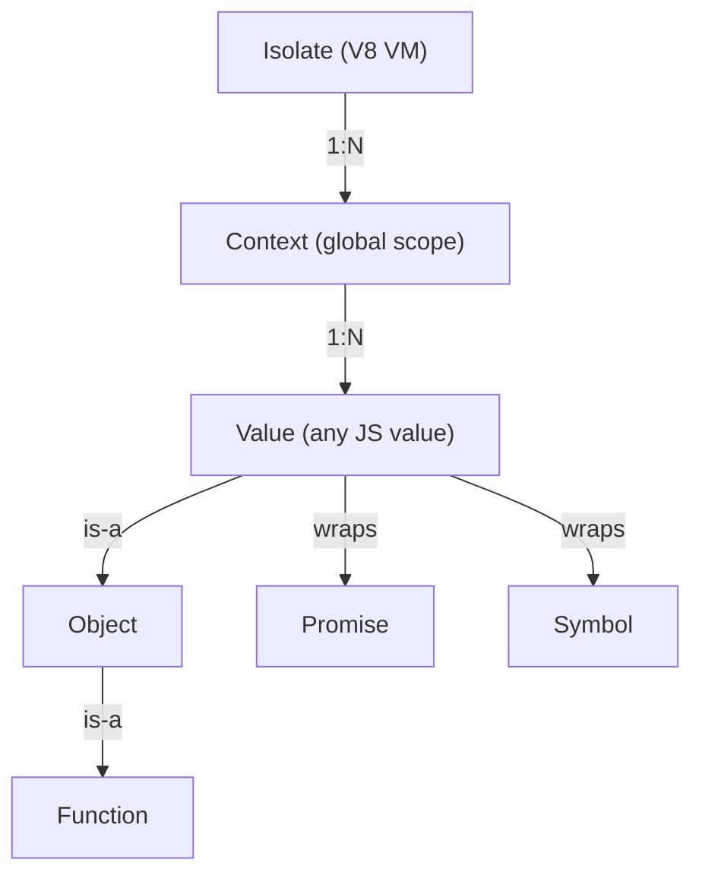
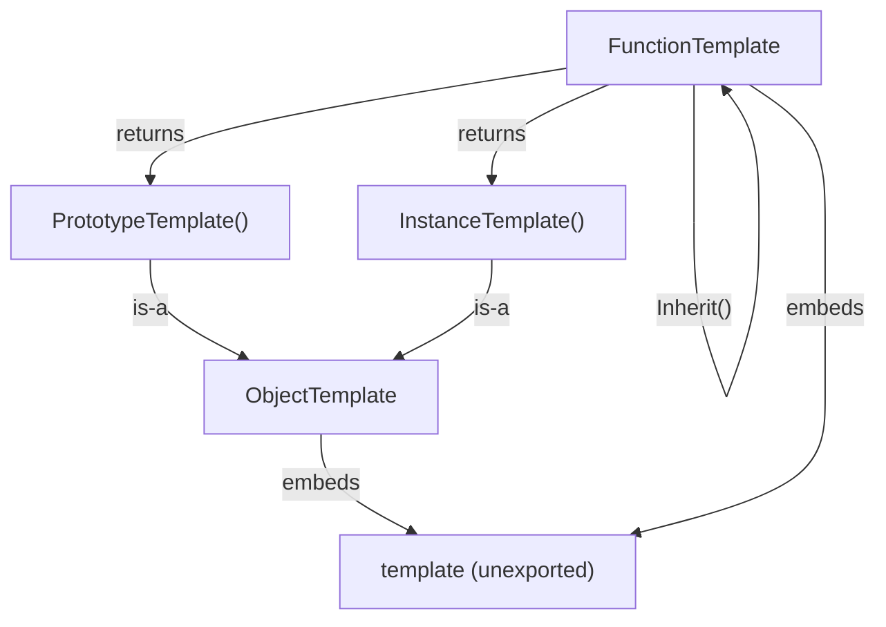
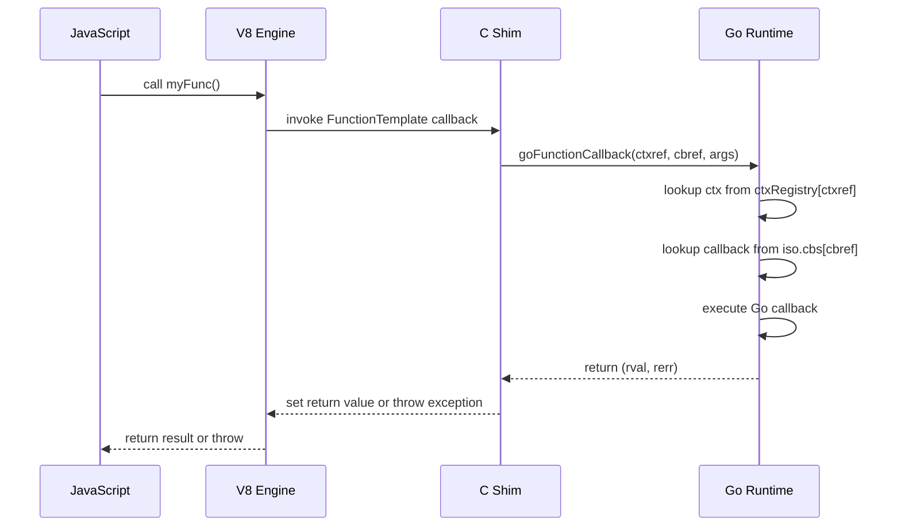
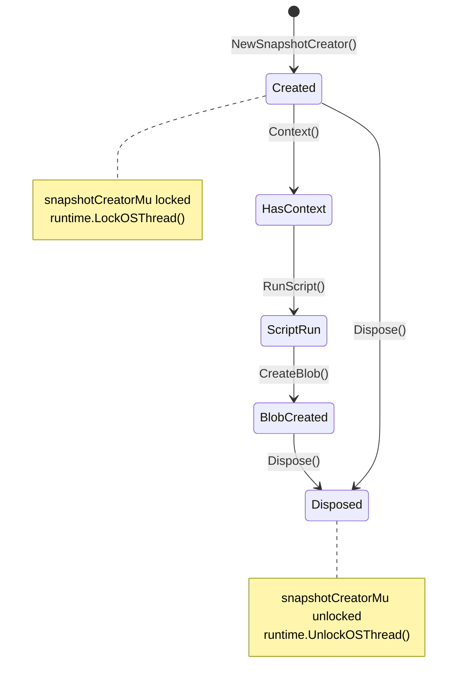
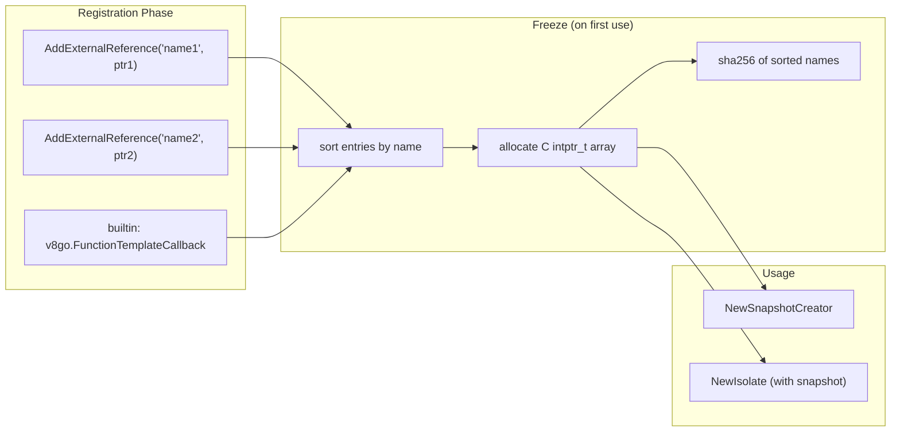
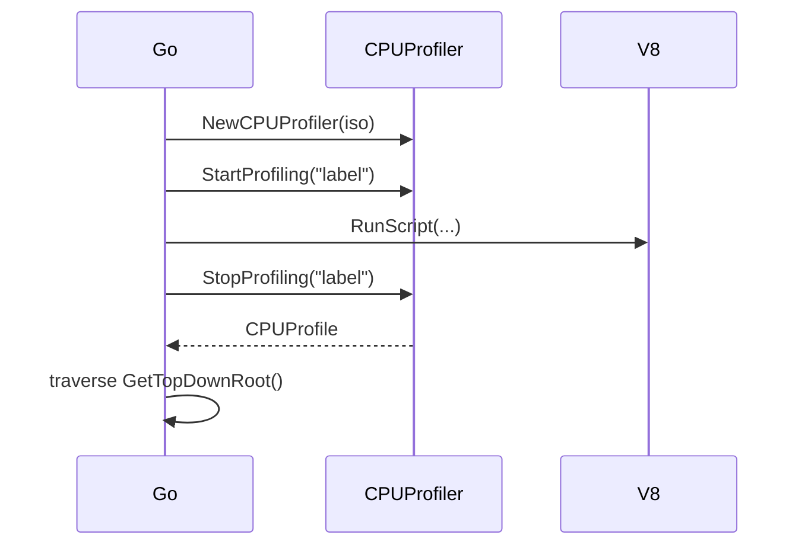
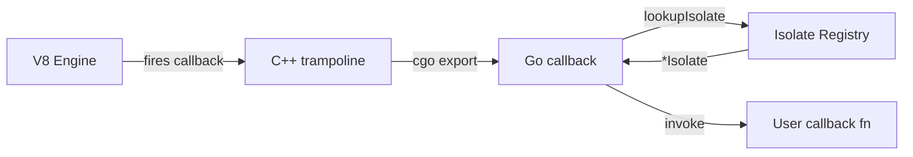
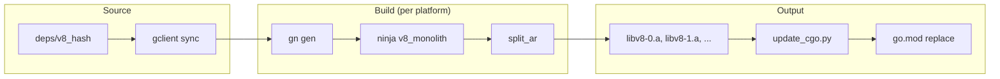

# Architecture

This document describes the internal design of the ChessCom/v8go library:
the object model, CGO bridge, snapshot system, concurrency model, and
supporting subsystems.

## Object model

v8go wraps V8's C++ API into a Go-idiomatic type hierarchy. The
ownership tree mirrors V8's:



**Isolate** is a self-contained V8 VM with its own heap and garbage
collector. Most applications create one isolate and multiple contexts.
Created via `NewIsolate()` with optional `IsolateOption` functions
(`WithSnapshotBlob`, `WithResourceConstraints`).

**Context** is a global execution environment within an isolate.
Contexts are isolated from each other — variables defined in one
context are not visible in another, even if they share an isolate.
Created via `NewContext()` with optional `ContextOption` arguments (an
`*Isolate` and/or an `*ObjectTemplate` for the global object).

**Value** is the base type for all JavaScript values. Every value is
bound to a context (and by extension, an isolate). Values carry a
C-side `ValuePtr` and expose type checks (`IsString`, `IsNumber`,
`IsObject`, etc.) and conversions (`String()`, `Int32()`, `Number()`,
`Object()`, etc.).

**Object**, **Function**, **Promise**, and **Symbol** are thin wrappers
over `Value` that add type-specific methods. They implement the
`Valuer` interface (`value() *Value`) so they can be used wherever a
`Value` is expected.

### Templates

Templates define the shape of objects and functions before any context
exists. They are bound to an isolate, not a context.



`ObjectTemplate` defines object structure (properties, internal
fields). `FunctionTemplate` defines callable objects with a Go callback.
Templates support `Set(name, value)`, `SetSymbol(sym, value)`,
`SetInternalFieldCount(n)`, and inheritance via `Inherit(base)`.

## CGO bridge

v8go uses CGO to call V8's C++ API through a C shim layer. The bridge
consists of:

```
    Go types          C shim (*.h / *.cc)         V8 C++ API
    ──────────        ─────────────────────       ──────────────
    Isolate.ptr  ──►  IsolatePtr (void*)     ──►  v8::Isolate*
    Context.ptr  ──►  ContextPtr (void*)     ──►  v8::Context
    Value.ptr    ──►  ValuePtr (void*)       ──►  v8::Value
    template.ptr ──►  TemplatePtr (void*)    ──►  v8::Template
```

### Source files

| File | Role |
|---|---|
| `v8go.h` / `v8go.cc` | Core exports: `Init`, `Version`, `SetFlags`, `NewIsolate`, `RunScript` |
| `isolate.h` / `isolate.cc` | Isolate lifecycle, heap stats, script compilation, idle tasks |
| `context.h` / `context.cc` | Context creation/disposal, `RunScript`, global object |
| `value.h` / `value.cc` | Value type checks, conversions, constructors |
| `object.h` / `object.cc` | Object property get/set/has/delete, enumeration, prototype |
| `function_template.h` / `function_template.cc` | FunctionTemplate creation, callback wiring, Fast API |
| `object_template.h` / `object_template.cc` | ObjectTemplate creation, property configuration |
| `snapshot.h` / `snapshot.cc` | **Fork-specific.** SnapshotCreator lifecycle, blob serialisation |
| `arraybuffer.h` / `arraybuffer.cc` | **Fork-specific.** ArrayBuffer creation (copy, alloc, external zero-copy) |
| `fast_api.h` / `fast_api.cc` | **Fork-specific.** V8 Fast API CFunctionInfo builder |
| `symbol.h` / `symbol.cc` | Well-known symbol accessors |
| `inspector.h` / `inspector.cc` | V8 Inspector protocol bridge |
| `errors.h` / `errors.cc` | Error/exception construction |
| `json.h` | JSON parse/stringify |
| `utils.h` / `utils.cc` | Helper macros and shared utilities |

### Callback trampoline

Go functions cannot be passed directly to C as function pointers.
v8go solves this with a trampoline pattern:



1. When `NewFunctionTemplate` is called, the Go callback is stored in
   `iso.cbs[cbref]` (a map protected by `iso.cbMutex`).
2. The C shim receives a static function pointer to
   `goFunctionCallback` (exported via `//export`) and the integer
   `cbref`.
3. When V8 invokes the function, the C shim calls back into Go with
   the context reference and callback reference.
4. `goFunctionCallback` looks up the context from `ctxRegistry` and
   the callback from `iso.cbs`, constructs a `FunctionCallbackInfo`,
   and invokes the Go function.
5. If the callback returns an error implementing `ValueError`, the
   error's `Value` is thrown as a JS exception. Otherwise `Error()` is
   stringified and thrown.

The trampoline's C address is registered in the external references
registry (see below) so it survives snapshot serialisation.

## Snapshot system

The snapshot system allows V8 heaps to be serialised at build time and
deserialised at runtime, eliminating the cost of parsing and compiling
JavaScript on every cold start.

### SnapshotCreator lifecycle



Key invariants:
- Only one `SnapshotCreator` can exist at a time (enforced by
  `snapshotCreatorMu`).
- The creator's goroutine is pinned to its OS thread
  (`runtime.LockOSThread`) because V8 requires all API calls against
  the creator's isolate to happen on the thread that called
  `Isolate::Enter`.
- After `CreateBlob`, the isolate is consumed — `Isolate()` and
  `Context()` return nil.

### External references registry

V8 stores function callback pointers inside snapshot blobs as indices
into an `external_references` array. The array must be identical
(same pointers in the same order) at snapshot creation and
restoration.



The registry is process-global and append-only until frozen. Freezing
happens automatically on the first call to `NewSnapshotCreator`,
`NewIsolate(WithSnapshotBlob(...))`, or `ExternalReferenceRegistryDigest`.
After freeze, `AddExternalReference` panics.

The sha256 digest of the sorted name list is stored in
`PackedSnapshot.RefsDigest` and compared at restore time to catch
registry mismatches before V8 can crash on dangling pointers.

### Pack/Restore envelope

The high-level `PackBundle`/`RestoreIsolate` API wraps the raw V8
snapshot in a self-describing envelope:

```
    Offset     Content
    ──────     ───────────────────────────────────────
    [0..5)     Magic: "BFV8\x01"
    [5..7)     uint16 LE: header length H
    [7..7+H)   JSON header (V8ABI, RefsDigest, BundleSHA256, ...)
    [7+H..)    Raw v8::StartupData bytes
```

`RestoreIsolate` validates:
1. V8 ABI tag matches the running V8 version.
2. External references digest matches the running registry.
3. Blob size exceeds `minPlausibleV8Blob` (1 KiB) to prevent V8
   fatal-aborts on truncated data.

On mismatch, it returns errors wrapping `ErrIncompatible` so callers
can fall back to a cold-start path.

### Snapshot stacking

`WithExistingSnapshotBlob` lets a `SnapshotCreator` warm-start from
a prior blob. The new blob is a strict superset — this enables
layered snapshots:

```
    Layer 1 (base):  polyfills + framework
    Layer 2 (app):   route handlers + config (built on top of layer 1)
```

The consumer only needs the final layer's blob; V8 handles the
internal layering.

## Concurrency model

v8go uses three categories of synchronisation:

### Process-wide mutexes

| Mutex | Protects | Held for |
|---|---|---|
| `snapshotCreatorMu` | V8 read-only heap state during snapshot creation | Entire `NewSnapshotCreator` → `Dispose` lifecycle |
| `snapshotDeserMu` | V8 shared-heap initialiser during isolate construction/disposal | `NewIsolate` and `Dispose` critical sections |
| `extrefMu` | External references registry reads and writes | Individual registry operations |

### Per-isolate state

| Lock | Protects |
|---|---|
| `iso.cbMutex` (`sync.RWMutex`) | Callback map (`iso.cbs`) for FunctionTemplate registrations |
| `sc.closeMu` (`sync.Mutex`) | SnapshotCreator's `created`/`closed` flags |

### Context registry

A global `ctxRegistry` map (protected by `ctxMutex`) maps integer
references to `*Context` pointers. This allows the C callback
trampoline to look up the Go context from a plain integer, working
around CGO's restriction on passing Go pointers to C.

### Thread affinity

`SnapshotCreator` calls `runtime.LockOSThread()` on construction and
`runtime.UnlockOSThread()` on disposal. This is required because V8's
`Isolate::Enter` records the calling thread and subsequent API calls
must happen on the same thread.

Normal isolates (created via `NewIsolate`) do not require thread
pinning — the Go runtime can schedule their goroutines freely as long
as only one goroutine accesses a given isolate at a time.

## Inspector and profiler

### Inspector

The `InspectorClient` interface connects V8's built-in inspector to
Go-side handlers:

```go
type ConsoleAPIMessageHandler interface {
    ConsoleAPIMessage(message ConsoleAPIMessage)
}
```

`NewInspectorClient` wraps a Go handler. `NewInspector` binds an
inspector client to an isolate. `ContextCreated`/`ContextDestroyed`
must be called to register contexts with the inspector.

`ConsoleAPIMessage` carries the message text, error level
(`MessageErrorLevel`), URL, line/column numbers, and a stack trace.

### CPU Profiler



`CPUProfiler` wraps `v8::CpuProfiler`. `StartProfiling`/`StopProfiling`
bracket the code to profile. The resulting `CPUProfile` exposes a tree
of `CPUProfileNode` values with function name, script resource,
line/column, and child nodes.

## Deterministic mode

The `WithDeterministicTime` snapshot creator option installs a
JavaScript shim that replaces non-deterministic APIs:

| API | Replacement |
|---|---|
| `Date.now()` | Returns `SeedTimeMillis` (fixed timestamp) |
| `Math.random()` | Mulberry32 PRNG seeded from the timestamp |
| `performance.now()` | Returns 0 |

This ensures snapshot contents are reproducible regardless of when or
where they are created. After restoration, `ResetNonDeterminism`
removes the shim so consumers get live wall-clock and random values.

The seed is configurable via `SeedTimeMillis` (default: a fixed epoch
value) or the `PackOptions.SeedMillis` field.

## Isolate callback architecture

The fork adds several V8 isolate-level callbacks that cross the
CGO boundary via trampoline functions in dedicated C++ files.



### Isolate registry

Since V8 callbacks pass only the `Isolate*` pointer (or nothing for
GC callbacks), the Go side maintains a `sync.RWMutex`-protected map
from `uintptr(iso.ptr)` → `*Isolate` in `isolate_registry.go`.
Every `NewIsolate` registers and every `Dispose` unregisters.

### Callback trampolines

Each callback category lives in its own `.h`/`.cc`/`.go` triple:

| Category | C++ file | Go export | V8 API |
|---|---|---|---|
| Heap limit | `heap_limit.cc` | `goNearHeapLimitCallback` | `AddNearHeapLimitCallback` |
| Promise reject | `promise_reject.cc` | `goPromiseRejectCallback` | `SetPromiseRejectCallback` |
| GC prologue | `gc_callback.cc` | `goGCPrologueCallback` | `AddGCPrologueCallback` (with data) |
| GC epilogue | `gc_callback.cc` | `goGCEpilogueCallback` | `AddGCEpilogueCallback` (with data) |
| Interrupt | `interrupt.cc` | _(C-only terminate)_ | `RequestInterrupt` |

The interrupt callback is special: it terminates execution directly in
C (`TerminateExecution`) without crossing back to Go, avoiding
reentrancy issues with CGO during JS execution.

| OOM error | `oom_handler.cc` | `goOOMErrorCallback` | `SetOOMErrorHandler` |

The OOM handler uses `Isolate::TryGetCurrent()` to recover the active
isolate pointer since V8's OOM callback signature does not include it.

### Microtask and external memory APIs

The following APIs are direct C shims without callback trampolines:

| API | C function | V8 call |
|---|---|---|
| `SetMicrotasksPolicy` | `IsolateSetMicrotasksPolicy` | `Isolate::SetMicrotasksPolicy` |
| `EnqueueMicrotask` | `IsolateEnqueueMicrotask` | `Isolate::EnqueueMicrotask(Local<Function>)` |
| `AdjustExternalMemory` | `IsolateAdjustExternalMemory` | `Isolate::AdjustAmountOfExternalAllocatedMemory` |

`EnqueueMicrotask` requires extracting the `v8::Function` from the
`m_value` wrapper and entering the value's context scope before
enqueuing.

### ArrayBuffer and external strings

`NewArrayBufferFromBytes` copies Go data into a V8-allocated
`BackingStore`. `NewArrayBufferAlloc` allocates an empty buffer; the
caller can then write directly into the backing store via
`ArrayBufferGetData`.

`NewArrayBufferExternal` provides true zero-copy: it wraps Go-owned
memory as an external `BackingStore` via `runtime.Pinner`, so JS and
Go share the same bytes. The fork's prebuilt V8 deps are compiled
with `v8_enable_sandbox=false`, enabling the zero-copy path. The C++
implementation (`arraybuffer.cc`) includes a fallback to alloc +
`memcpy` for custom V8 builds with the sandbox enabled; the runtime
function `SandboxEnabled()` reports which mode is active.

`NewExternalOneByteString` wraps a C++ `ExternalOneByteStringResource`
subclass that points at Go-owned memory. V8 reads directly from the Go
slice; the caller must ensure the slice outlives the V8 string.

### V8 Fast API callbacks

`NewFastFunctionTemplate` (`function_template.{h,cc,go}`) registers a
V8 `CFunction` alongside the normal slow-path Go callback. When
TurboFan optimizes a call site and proves argument types match the
`FastCallDescriptor`, it invokes the C function directly — bypassing
CGo, argument marshaling, and `m_value` allocation.

The type descriptor is built at runtime by `BuildCFunctionInfo`
(`fast_api.{h,cc}`), which constructs a `v8::CFunctionInfo` from a
C-level `CTypeInfoType` array. The Go side exposes a `CType` enum and
`FastCallDescriptor` struct that map to these C types. The fast
function pointer and `CFunctionInfo` are passed to
`FunctionTemplate::New` via its `CFunction` overload.

Constraints: the fast function must be C-linkage, must not allocate on
the JS heap or trigger JS execution, and its address must be registered
via `AddExternalReference` for snapshot compatibility.

### Idle-task GC scheduling

`RunIdleTasks(deadlineSeconds)` (`isolate.{h,cc,go}`) calls
`platform::RunIdleTasks` with the default platform and a time budget.
V8 uses this window for incremental GC sweeping, deoptimization
cleanup, and code aging. The platform is initialized with
`IdleTaskSupport::kEnabled` to activate idle task posting.

### Named property interceptors

`ObjectTemplateSetNamedPropertyHandler` installs getter/setter
interceptors on an `ObjectTemplate`. The callbacks route through the
isolate's callback registry using the same `Integer` data pattern as
`FunctionTemplateCallback`. The getter trampoline returns
`Intercepted::kYes` with a value set on `info.GetReturnValue()`, or
`Intercepted::kNo` for fall-through.

### ES Modules

`CompileESModule` compiles an ES module source into a `v8::Module`,
stored in a C-side `m_module` struct with `Persistent<Module>`. The
module lifecycle follows V8's ECMAScript module semantics:

1. **Compile** → `ModuleStatusUninstantiated`
2. **Instantiate** (with `ResolveModuleCallback`) → `ModuleStatusInstantiated`
3. **Evaluate** → `ModuleStatusEvaluated` or `ModuleStatusErrored`

The resolve callback uses the same trampoline pattern as other
callbacks: the Go-side stores a per-context resolver function in a
global map keyed by context reference, and the C++ trampoline
(`resolveModuleTrampoline`) extracts the context reference from
`GetEmbedderData(1)` and calls the Go export `goResolveModuleCallback`.

Module pointers are managed separately from Values because
`v8::Module` inherits from `v8::Data`, not `v8::Value`.

### Heap profiler

`IsolateTakeHeapSnapshot` captures a heap snapshot via
`HeapProfiler::TakeHeapSnapshot`, serializes it to JSON through a
`StringOutputStream` adapter, copies the result to a `malloc`'d buffer,
and deletes the V8-side snapshot. The Go side copies the buffer into a
Go byte slice and frees the C buffer.

## V8 build pipeline

The fork maintains its own V8 static libraries (with
`v8_enable_sandbox=false`) rather than consuming upstream's prebuilt
deps. The build pipeline produces split archives for 4 platforms.



### Platform decision tree

Each platform requires specific build flags to produce archives
that are compatible with the target's system linker:

| Platform | `is_clang` | `use_sysroot` | `use_custom_libcxx` | Reason |
|----------|-----------|---------------|---------------------|--------|
| linux/amd64 | `false` (gcc) | `false` | `false` | GNU `ld` cannot parse clang's ELF objects |
| linux/arm64 | `true` | `true` | `true` | Cross-compile from x86\_64; system headers lack C++20 |
| darwin/arm64 | `true` | `false` | `false` | Native build |
| darwin/amd64 | `true` | `false` | `true` | Cross-compile from arm64; system headers vary |

### Sandbox-disabled implications

With `v8_enable_sandbox=false`:

- `v8::ArrayBuffer::NewBackingStore` accepts external (Go-owned)
  memory pointers, enabling true zero-copy `NewArrayBufferExternal`.
- The `V8_ENABLE_SANDBOX` preprocessor define is absent from `cgo.go`,
  so C++ code compiled by CGo takes the non-sandbox code paths.
- `SandboxEnabled()` returns `false` at runtime.
- V8's virtual memory cage is not allocated, slightly reducing the
  process address space footprint.

See [docs/maintaining.md](maintaining.md) for full rebuild
instructions via CI or locally.
